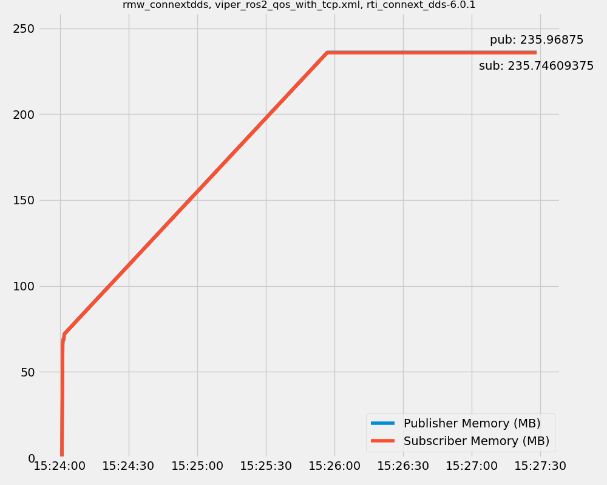

# connextdds_memleak

Attempts to reproduce a potential memory leak when using rmw_connextdds with ROS 2.

The result was that it wasn't a memory leak, but instead a shmem setting that caused unexpected memory growth that was ultimately bounded.

## Running

The quickstart is to set up your environment how ever you want to test it, then run:

```
python3 ./monitor_pub_echo_mem.py
```

This will run a pair of processes to test pub/echo with `ros2 topic`.
Meanwhile monitoring the memory usage, plotting it live, and depositing the data into a csv file.

Optionally, you can adjust the publish rate with the `--publish-rate` option (Hz).

The csv log files start with `memory_log-` and can be plotted afterwards with:

```
python3 ./plot_memory_log.py <path/to/memory_log-*.csv>
```

The first few lines of the csv log file contain details about the run commented with `#`.
Afterwards, the csv takes the form of `timestamp, pub memory in MB, echo memory in MB`.

### Examples of Different Configurations

If you want to change the rmw implementation to `rmw_connextdds`:

```
RMW_IMPLEMENTATION=rmw_connextdds python3 ./monitor_pub_echo_mem.py
```

If you want to use a custom QoS XML:

```
NDDS_QOS_PROFILES=`pwd`/builtin_keep_last_reliable_large_data.xml \
RMW_IMPLEMENTATION=rmw_connextdds \
python3 ./monitor_pub_echo_mem.py
```

### How to Reproduce the Ramp Curve Example

We've narrowed it down to the shared memory settings, which are needed to get the observed "ramp" shaped curve.
Where the memory use climbs quickly but then stabalizes are some memory usage level:



The environement used is:

- ROS 2 Rolling
- Connext 6.0.1 (though it has been observed with 5.3.1 and 6.1+)

And the command used:

```
RMW_IMPLEMENTATION=rmw_connextdds \
NDDS_QOS_PROFILES=/home/william/connextdds_memleak/viper_ros2_qos_with_tcp.xml \
python3 ./monitor_pub_echo_mem.py --publish-rate 1000
```

The high publish rate just increases the rate of memory use increase.
Lower publish rates still produce the same curve, just over a longer period.
With a rate of 1kHz the stable memory usage limit can been reached in a few minutes.
